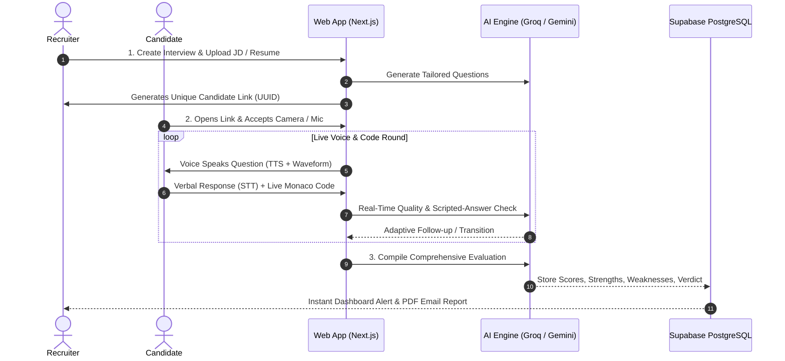
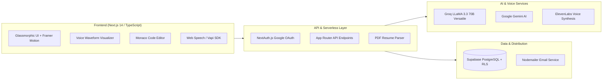
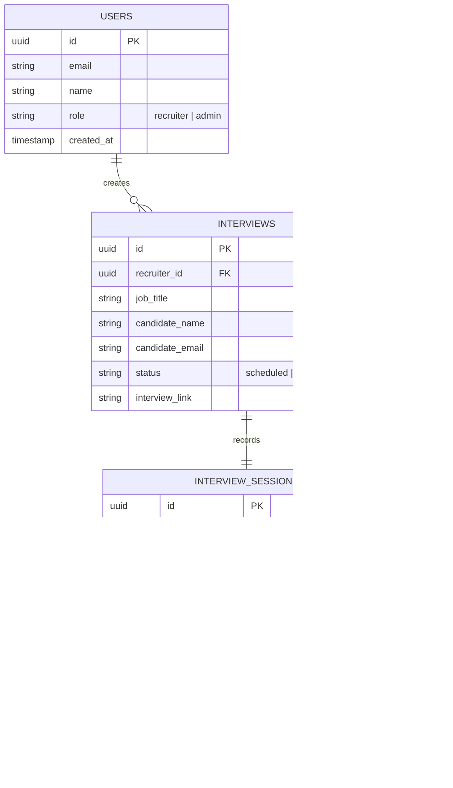

# 🎙️ AI Voice Recruiter

<div align="center">


**Next-Generation Autonomous Voice AI Recruiter with Enterprise RAG & Technical Interview Intelligence**

*Conduct real-time voice interviews, evaluate coding challenges on the fly, ground scoring in standard rubrics, search talent semantically via RAG, and detect cheating.*

[Live Demo](#-quick-start) • [RAG Architecture](#-enterprise-rag-architecture) • [Candidate Experience](#-candidate-interview-room) • [Recruiter Suite](#-recruiter--admin-intelligence)

</div>

---

## ⚡ What is AI Voice Recruiter?

**AI Voice Recruiter** transforms the traditional hiring funnel into an autonomous, voice-first AI evaluation pipeline powered by **Enterprise RAG (Retrieval-Augmented Generation)**. Candidates converse naturally with an AI interviewer that listens, retrieves verified evidence chunks from their uploaded resume, evaluates live coding submissions in real-time, grades answers objectively against gold-standard rubrics, and enables recruiters to search candidates using natural language.

```
       [ 📄 Job Description + Resume ]
                     │
                     ▼
         ┌─────────────────────────┐
         │ Enterprise RAG Pipeline │ ◄─── (Supabase pgvector 768-dim)
         │ • Resume Evidence Chunks│
         │ • Gold-Standard Rubrics │
         │ • ATS Semantic Matching │
         └───────────┬─────────────┘
                     │
                     ▼
          ┌─────────────────────┐
          │   AI Voice Engine   │ ◄─── (Groq LLaMA 3.3 + ElevenLabs TTS)
          └──────────┬──────────┘
                     │  (Voice & Code Interaction)
                     ▼
        ┌───────────────────────────┐
        │  Candidate Interview Room │
        │  • Real-time Voice STT/TTS│
        │  • Live Monaco Code Editor│
        │  • Tab-Switch Anti-Cheat  │
        │  • Script-Reading Detector│
        └────────────┬──────────────┘
                     │
                     ▼
       [ 📊 Comprehensive Report & Scorecard ] ──► Recruiter Email & Dashboard
```

---

## 📸 Visual Workflow

### 1. The Autonomous Hiring Lifecycle



---

## ✨ Key Features & Capabilities

| Feature | Description |
| :--- | :--- |
| 🎙️ **Voice-to-Voice AI** | Human-like conversational flow using ElevenLabs voice synthesis & browser-native speech recognition. |
| 💻 **Integrated Monaco Code Editor** | Live coding challenges with syntax highlighting (JS, Python, C++, Java, Go) and automated AI evaluation. |
| 📄 **Smart Resume Parsing & RAG** | Automatically extracts skills, experience, and past projects from PDF resumes; chunks and indexes in pgvector for deep-dive questioning. |
| 🔍 **AI Talent Matcher (ATS RAG)** | Recruiter natural language candidate search (e.g. "Senior React engineer with WebSockets") powered by 768-dim vector embeddings. |
| 🎯 **Evaluation Rubric RAG** | Objective candidate scoring grounded against indexed gold-standard technical benchmarks and criteria rubrics. |
| 🛡️ **Anti-Cheat Proctoring** | Active tab-switch detection, webcam presence monitoring, and speech cadence analysis to flag scripted reading. |
| 📊 **Multi-Metric Rubric** | Scores candidates across **Technical Depth**, **Communication**, **Problem Solving**, and **Professionalism**. |
| 👑 **Enterprise Admin Suite** | Aggregated hiring funnels, recruiter leaderboards, score distributions, and reusable template libraries. |

---

## 🧠 Enterprise RAG Architecture (Retrieval-Augmented Generation)

AIRA integrates full-stack vector search powered by **Supabase PostgreSQL (`pgvector`)** and 768-dimensional normalized embeddings:

```
[Candidate PDF Resume] ──► [Semantic Chunker] ──► [768-dim Embeddings] ──► [Supabase pgvector (HNSW)]
                                                                                   │
    ┌──────────────────────────────────────────────────────────────────────────────┴─────────────────────────┐
    ▼                                              ▼                                                         ▼
[Option A: Resume RAG]                 [Option B: Rubric RAG]                                   [Option C: ATS Talent Match]
Live Interview Deep-Dive               Objective Answer Scoring                                 Natural Language Candidate Discovery
"On your resume you deployed           Grading grounded against                                 Recruiters query:
Kubernetes with Helm; how did          gold-standard engineering criteria                       "Senior React engineer with
you configure zero-downtime?"          (React, Databases, DevOps, STAR)                         WebSockets & Docker experience"
```

### Core RAG Capabilities:
1. **Option A: Resume RAG (Live Targeted Questioning)**
   - Automatically chunks candidate resumes on upload by semantic section (Experience, Projects, Education, Skills).
   - Dynamically retrieves real candidate evidence during live interview pacing to challenge architectural decisions, metrics, and trade-offs.
   - Detects vague answers and fires dynamic follow-up verification probes.

2. **Option B: Evaluation Rubric RAG (Objective Answer Scoring)**
   - Pre-seeds official gold-standard answer benchmarks and criteria rubrics in `evaluation_rubrics`.
   - Replaces subjective LLM grading with verifiable criteria satisfaction (`criteria_met`) on a calibrated 1–10 scale.

3. **Option C: ATS Smart Resume Matching (Vector Search across Candidates)**
   - Indexes applicant profiles into `candidate_profiles` for sub-millisecond semantic search.
   - Recruiters search candidates in natural language via the glassmorphic **AI Talent Matcher** console (`/dashboard/talent-search`).

4. **Option D: All-in-One Shared Architecture (TypeScript & Python FastAPI)**
   - Dual-runtime embedding services in TypeScript (`lib/rag/embeddings.ts`) and Python (`backend/services/embedding_service.py`).
   - Resilient semantic projection fallback guaranteeing 100% uptime even without external API credits.
   - High-throughput Python FastAPI microservice endpoints (`/api/rag/embed`, `/api/rag/similarity`, `/api/rag/status`).

---

## 🏛️ Architecture



---

## 🎯 Candidate Interview Room

The candidate interface (`/interview/[id]`) is optimized for focus, low latency, and ease of use:

```
┌────────────────────────────────────────────────────────────────────────┐
│ 🎙️ AI Voice Recruiter               ⏱️ Time Left: 14:32   [End Session]│
├───────────────────────────────────┬────────────────────────────────────┤
│                                   │                                    │
│   🤖 AI Interviewer               │   💻 Live Coding Workspace         │
│   "Explain how you optimize       │   ┌────────────────────────────┐   │
│    database queries in Postgres." │   │ function optimizeQuery() { │   │
│                                   │   │   // Candidate writes code │   │
│       (( ılılılllılı ))           │   │ }                          │   │
│    [ Voice Waveform Playing ]     │   └────────────────────────────┘   │
│                                   │   [ Run Code ]    [ Submit ]       │
│ ───────────────────────────────── │ ────────────────────────────────── │
│   🧑 Candidate Video & Live STT   │   🛡️ Proctoring Monitor            │
│   "I usually start by indexing... │   • Camera: Active  • Tabs: 0 Sw.  │
└───────────────────────────────────┴────────────────────────────────────┘
```

---

## 🗄️ Database Schema

The database runs on **Supabase (PostgreSQL)** with Row-Level Security:



---

## 🚀 Quick Start

### 1. Prerequisites
* **Node.js**: `v18.0.0` or higher
* **Package Manager**: `npm` or `pnpm`
* **Accounts**: Supabase, Groq / Google AI Studio, Google Cloud OAuth

### 2. Clone & Install
```bash
# Clone the repository
git clone https://github.com/KUSHALMN/ai-voice-recruiter.git
cd ai-voice-recruiter

# Install all dependencies
npm install
```

### 3. Configure Environment Variables
Create a `.env.local` file in the root directory:

```env
# App URL & Auth Secret
NEXTAUTH_URL=http://localhost:3000
NEXTAUTH_SECRET=your-super-secret-key-32-chars

# Google OAuth Credentials
GOOGLE_CLIENT_ID=your-google-client-id.apps.googleusercontent.com
GOOGLE_CLIENT_SECRET=your-google-client-secret

# Supabase Credentials
NEXT_PUBLIC_SUPABASE_URL=https://your-project.supabase.co
NEXT_PUBLIC_SUPABASE_ANON_KEY=your-supabase-anon-key
SUPABASE_SERVICE_ROLE_KEY=your-supabase-service-role-key

# AI Providers
GROQ_API_KEY=gsk_your_groq_api_key
GEMINI_API_KEY=your_gemini_api_key
ELEVENLABS_API_KEY=your_elevenlabs_api_key

# Email Dispatch
EMAIL_USER=your-email@gmail.com
EMAIL_PASS=your-app-password
```

### 4. Run Development Server
```bash
# Launch Next.js with Turbopack
npm run dev

# Open http://localhost:3000 in your browser
```

---

## 📊 Evaluation Scorecard Preview

Every completed interview generates an actionable AI hiring dossier:

| Evaluation Metric | Max Score | AI Criteria |
| :--- | :---: | :--- |
| 🧠 **Technical Accuracy** | `10/10` | Algorithm correctness, conceptual clarity, language mastery |
| 🗣️ **Communication** | `10/10` | Conciseness, structure, articulation, lack of filler |
| 💡 **Problem Solving** | `10/10` | Analytical approach, handling edge cases, optimization |
| 🎯 **Confidence** | `10/10` | Delivery tone, hesitation index, speech pacing |
| 📋 **Resume Fidelity** | `10/10` | Verification of claims made in candidate CV against answers |

---

## 📂 Project Structure

```
ai-voice-recruiter/
├── app/
│   ├── admin/                # Admin portal & enterprise analytics
│   ├── api/                  # 20+ Serverless API routes (AI, TTS, evaluation)
│   ├── dashboard/            # Recruiter workspace, interview creator & reports
│   ├── interview/[id]/       # Live candidate voice & code interview room
│   ├── login/                # Google OAuth authentication flow
│   └── page.tsx              # High-conversion landing page
├── components/
│   ├── interview/            # VoiceWave, Monaco CodeEditor, ResumeModal
│   ├── DashboardCharts.tsx   # Visual metrics & radar scorecards
│   └── TopBar.tsx            # Navigation & session controls
├── lib/
│   ├── ai/                   # AI prompts, scoring rubrics & LLM clients
│   ├── gemini.ts             # Groq & Gemini multi-model fallback handler
│   ├── supabase.ts           # Supabase client & connection pooling
│   └── resume/               # PDF parse and extraction pipeline
├── public/                   # Static assets, logos & sound effects
├── supabase-schema.sql       # Complete database migration SQL
└── package.json              # Project dependencies & scripts
```

---

## 🔒 Security & Enterprise Compliance

AI Voice Recruiter is engineered with multi-tier defense-in-depth protection:
- **Strict Content Security Policy (CSP)**: Nonce-ready frame-ancestors locking, HSTS preload, zero clickjacking (`X-Frame-Options: DENY`).
- **Edge Attack Shield**: IP burst rate-limiting, scanner probe blocking (`.env`, `.git`, `/wp-admin`), and path-traversal prevention in edge middleware.
- **Candidate Anti-Tamper**: DevTools detection, tab-switch monitoring, and copy/paste locking during live technical assessments.
- **Input Sanitization & CSRF Protection**: Recursive HTML entity escaping, SQL injection guards, and cryptographic double-submit cookie tokens.
- **GDPR & CCPA Compliant**: Full candidate Right-to-be-Forgotten data erasure endpoint (`/api/compliance/delete-data`), granular cookie consent banner, and transparent [Privacy Policy](/privacy) & [Terms of Service](/terms).

For full details and vulnerability disclosure guidelines, see [docs/SECURITY.md](docs/SECURITY.md).

---

## 🛡️ License

Distributed under the **MIT License**. See `LICENSE` for details.

<div align="center">

**Crafted with ❤️ by [KUSHAL M N](https://github.com/KUSHALMN)**

</div>