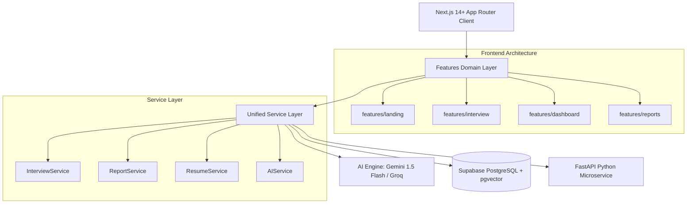

# AI Voice Recruiter - Enterprise Architecture

## 1. High-Level Architecture Overview

The AI Voice Recruiter is architected as a modular, domain-driven full-stack system designed for low-latency autonomous voice interviews, live technical coding sandboxes, and automated executive scorecards.

---

## 2. Directory Layout & Standards

Conforming to tier-1 tech product standards (Linear, Vercel, Stripe), the codebase adheres to strict separation of concerns:

- `app/`: Next.js App Router providing routing, server components, and RESTful API endpoints.
- `features/`: Domain-driven feature slices (components, hooks, types, and logic co-located by domain).
  - `features/interview/`: Candidate voice room, Web Audio, code execution workspace, integrity proctor.
  - `features/landing/`: Hero, features grid, pricing, workflow, interactive demo.
  - `features/dashboard/`: Recruiter metrics, candidate interview tables, quick actions.
  - `features/reports/`: Executive dossiers, radar charts, transcript review.
- `services/`: Encapsulates all business logic, database queries, and external AI orchestrations.
- `components/ui/`: Atomic design primitives (Button, Card, Badge, Modal, Skeleton).
- `components/layout/`: Global layout components (Container, PageHeader, Sidebar, TopBar).
- `components/feedback/`: Loading spinners, empty states, error boundaries.
- `hooks/`: Reusable React hooks (`useAudioStream`, `useSpeechSynthesis`, `useDebounce`, `useClipboard`, `useMediaQuery`).
- `types/`: Strongly-typed domain models and API contracts (`interview.ts`, `report.ts`, `candidate.ts`, `api.ts`).
- `backend/`: High-performance Python FastAPI service for RAG vector indexing, embedding generation, and TTS audio processing.

---

## 3. Real-Time Audio & Voice Pipeline

1. **Candidate Speech**: Captured via browser `navigator.mediaDevices.getUserMedia` and Web Speech API / MediaRecorder.
2. **Audio Stream Visualizer**: Real-time frequency analysis rendered via HTML5 canvas and Web Audio `AnalyserNode`.
3. **Speech Synthesis**: Ultra-low latency voice generation via Edge TTS and Web Speech Synthesis API.
4. **Adaptive Pacing**: Time-budgeted pacing engine ensures the candidate is asked balanced questions within their time limit without abrupt cutoffs.

---

## 4. Proctoring & Anti-Cheat Security

- **Visibility & Focus Detection**: Detects window minimization, background tab switching, and blur events.
- **Speech Entropy & Script Detection**: Monitors candidate answer timing and linguistic patterns to detect reading from scripted LLM answers.
- **Audit Logging**: All suspicious events are timestamped and surfaced in the final executive report.

---

## 5. Deployment & Scalability

- **Frontend**: Deployed seamlessly on Vercel with edge-ready API routes.
- **Database**: Supabase PostgreSQL with `pgvector` extension for semantic candidate search.
- **Microservices**: Containerized FastAPI service deployable via Docker or serverless GPU/CPU instances.
